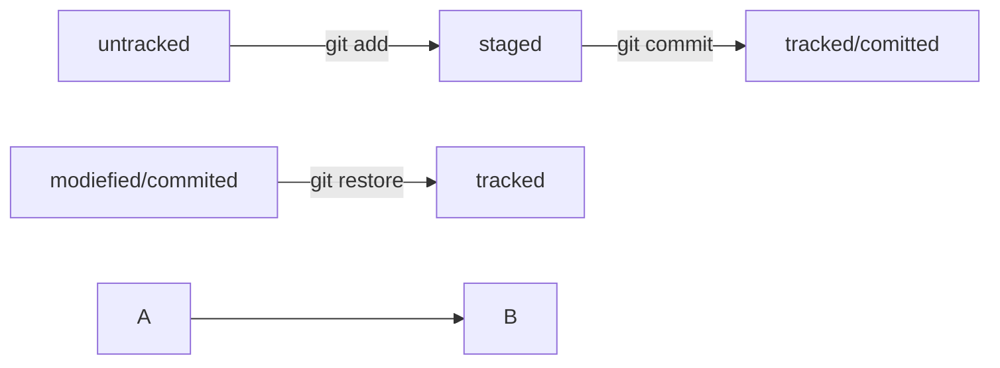

#Как я делал проект

1. Перейти в папку
```$ cd ~/dev
```
2. Создать папку
```$ mkdir second-project
```
3. Изменить директорию 
```$ cd ~/second-project
```
4. Создать файл
```$ touch README.md
```
5. Сделал в файле изменения 
6. Добавил файл в гит
```$ git add readme.md
```
7.



